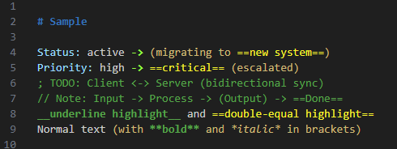

# NNYJ Syntax Highlight

Custom TextMate grammar injections and table decorations for VS Code.



## Markdown Injections

| Grammar | What it highlights |
|---|---|
| `markdown.arrow` | Arrow operators (`->`, `<-`, `-->`, `<--`) |
| `markdown.bracket` | Parenthesized expressions `(...)`, supports bold/italic/highlight inside |
| `markdown.colon` | Colon-terminated labels and key-value patterns |
| `markdown.comment` | Lines starting with `;` or `//` |
| `markdown.highlight` | `==highlighted==` and `__underlined__` text |

All markdown injections exclude `meta.embedded` and `markup.fenced_code` scopes to avoid interfering with syntax-highlighted code blocks.

## Indented Fenced Code Block Fix

Fenced code blocks inside list items lose syntax highlighting for bash/sh/zsh, dockerfile, makefile, diff. The markdown grammar's list handling consumes leading whitespace, so language grammars anchored to `^` fail. `markdown.fenced_fix` adds `\G` alongside `^` in critical patterns.

Upstream: [vscode#194998](https://github.com/microsoft/vscode/issues/194998) (closed without fix, VSCode considers it a per-language-grammar problem)

## Fenced Code Block Coloring

Unlabeled ` ``` ` blocks can be colored via settings. The 3-segment `markup.fenced_code` selector is intentional: language-specific scopes (4+ segments) override it for yml, bash, etc.

```json
{
  "scope": "markup.fenced_code",
  "settings": { "foreground": "#CE9178" }
},
{
  "scope": "markup.fenced_code punctuation.definition.markdown",
  "settings": { "foreground": "#d4d4d4" }
},
{
  "scope": "fenced_code.block.language",
  "settings": { "foreground": "#d4d4d4" }
}
```

## Table Decorations

Pipe-delimited markdown tables get visual styling in the editor:

- Header row: bold + background highlight + bottom border
- Separator row: faded to near-invisible
- Data rows: bottom border
- Pipe characters: dimmed

Works with both indented and non-indented tables. Requires header + separator + at least one data row.

## Terraform HCL Injection

| Grammar | What it highlights |
|---|---|
| `yaml.heredoc.hcl` | YAML syntax inside `<<YAML` / `<<-YAML` heredoc blocks |

Requires disabling semantic highlighting for TextMate grammars to take effect:

```json
{
  "[terraform]": {
    "editor.semanticHighlighting.enabled": false
  }
}
```

## Install

```sh
npm run package
code --install-extension nnyj-syntax-highlight-0.0.3.vsix
```

## Customizing Colors

Add `editor.tokenColorCustomizations` to your `settings.json`:

```json
{
  "editor.tokenColorCustomizations": {
    "textMateRules": [
      { "scope": "markdown.highlight", "settings": { "foreground": "#f7f42e" } },
      { "scope": "markdown.comment", "settings": { "foreground": "#57A64A" } },
      { "scope": "markdown.colon", "settings": { "foreground": "#9CDCFE" } },
      { "scope": "markdown.bracket", "settings": { "foreground": "#ceba78" } },
      { "scope": "markdown.arrow", "settings": { "foreground": "#97ff42", "fontStyle": "bold" } }
    ]
  }
}
```

## Known Limitations

- Unlabeled ` ``` ` block coloring requires settings rules (above) since VSCode textMateRules don't support scope subtraction
- Bold/italic/highlight work inside brackets, but other inline patterns (links, images) may not
- Indented fenced block fix does not cover makefile `ifeq`/`ifdef`/`define`/`endif` blocks
