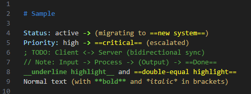

# vscode-nnyj-syntax-highlight

<div align="center">

[](https://github.com/nnyj/vscode-nnyj-syntax-highlight/stargazers)

</div>

VS Code extension that adds TextMate grammar injections for Markdown and Terraform HCL, plus programmatic table decorations and shell comment coloring.



## Features

### Markdown injections

| Grammar | Highlights |
|---------|-----------|
| `markdown.arrow` | Arrow operators: `->`, `<-`, `-->`, `<--` |
| `markdown.bracket` | Parenthesized expressions `(...)`, supports bold/italic/highlight inside |
| `markdown.colon` | Colon-terminated labels and key-value patterns |
| `markdown.comment` | Lines starting with `;` or `//` |
| `markdown.highlight` | `==highlighted==` and `__underlined__` text |

All markdown injections exclude `meta.embedded` and `markup.fenced_code` scopes to avoid interfering with code blocks.

### Fenced code block fix

Fenced code blocks inside list items lose syntax highlighting for bash/sh/zsh, dockerfile, makefile, diff. This extension adds `\G` alongside `^` in the critical patterns to restore it. Upstream: [vscode#194998](https://github.com/microsoft/vscode/issues/194998) (closed without fix).

### Shell comment coloring

`#` comment lines inside fenced bash/sh/zsh blocks are colored via programmatic decoration, working around a VS Code TextMate tokenization limitation that consumes the first content line before `source.shell` runs.

### Table decorations

Pipe-delimited markdown tables get visual styling: bold header row with bottom border, dimmed separator row, bordered data rows, dimmed pipe characters. Requires header + separator + at least one data row.

### Terraform HCL injection

`yaml.heredoc.hcl` provides YAML syntax inside `<<YAML` / `<<-YAML` heredoc blocks. Requires:

```json
{ "[terraform]": { "editor.semanticHighlighting.enabled": false } }
```

## Customizing colors

Add to `editor.tokenColorCustomizations.textMateRules` in `settings.json`:

```json
{ "scope": "markdown.highlight", "settings": { "foreground": "#f7f42e" } },
{ "scope": "markdown.comment",   "settings": { "foreground": "#57A64A" } },
{ "scope": "markdown.colon",     "settings": { "foreground": "#9CDCFE" } },
{ "scope": "markdown.bracket",   "settings": { "foreground": "#ceba78" } },
{ "scope": "markdown.arrow",     "settings": { "foreground": "#97ff42", "fontStyle": "bold" } }
```

Unlabeled ` ``` ` blocks can be colored via the `markup.fenced_code` scope (3-segment selector; language-specific scopes at 4+ segments override it automatically).

## Known limitations

- Bold/italic/highlight work inside brackets, but links and images may not
- Indented fenced block fix does not cover makefile `ifeq`/`ifdef`/`define`/`endif` blocks

## Install

```sh
npm run package
code --install-extension nnyj-syntax-highlight-0.0.8.vsix
```

## License

[MIT](LICENSE)
