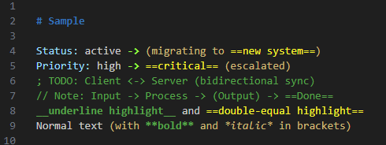

# NNYJ Syntax Highlight

<div align="center">

[](https://github.com/nnyj/vscode-nnyj-syntax-highlight/stargazers)
[](https://github.com/nnyj/vscode-nnyj-syntax-highlight/releases)
[](https://github.com/nnyj/vscode-nnyj-syntax-highlight/releases/latest)
[](https://github.com/nnyj/vscode-nnyj-syntax-highlight/actions)

</div>

Custom Markdown and Terraform syntax colors with inline Markdown rendering in the native VS Code editor.



## Features

### Inline Markdown

- Headings, emphasis, links, lists, tables, code, images, math, and Mermaid use editor decorations.
- Images alone on their line render inline, local files reload on change.
- With the [inset helper](inset_helper/README.md) installed, images and Mermaid diagrams render full size in a box below their lines, pushing text down.
- Without the helper, images are drawn over their line and the blank lines below it, Mermaid diagrams are fitted into their code block lines.
- Markdown markers appear while editing their content.
- `Toggle Markdown Decorations` switches rendering for the current file.
- `nnyjEditorStyling.inline.enabled` switches the complete renderer on or off while keeping custom syntax colors and table borders.
- Existing `markdownInlineEditor.*` settings control individual rendering features and colors.

### Markdown injections

| Grammar | Highlights |
|---------|-----------|
| `markdown.arrow` | Arrow operators: `->`, `<-`, `-->`, `<--` |
| `markdown.bracket` | Parenthesized expressions `(...)`, supports bold/italic/highlight inside |
| `markdown.colon` | Colon-terminated labels and key-value patterns |
| `markdown.comment` | Lines starting with `;` or `//` |
| `markdown.highlight` | `==highlighted==` and `__underlined__` text |

All markdown injections exclude `meta.embedded` and `markup.fenced_code` scopes to avoid interfering with code blocks.

### Fenced code block fix

Fenced code blocks inside list items lose syntax highlighting for bash/sh/zsh, dockerfile, makefile, diff. This extension adds `\G` alongside `^` in the critical patterns to restore it. Upstream: [vscode#194998](https://github.com/microsoft/vscode/issues/194998) (closed without fix).

### Shell comment coloring

`#` comment lines inside fenced bash/sh/zsh blocks are colored via programmatic decoration, working around a VS Code TextMate tokenization limitation that consumes the first content line before `source.shell` runs.

### Table decorations

Pipe-delimited Markdown tables use 30% opacity row borders and fixed-width vertical separators. Cell text stays editable with the same layout regardless of cursor position. Table emoji occupy two-character boxes, including when inline rendering is disabled. NNYJ Tweaks supplies navigation and Unicode text padding. With inline rendering disabled, custom decorations provide bold headers and dim separator rows and pipes.

### Terraform HCL injection

`yaml.heredoc.hcl` provides YAML syntax inside `<<YAML` / `<<-YAML` heredoc blocks. Requires:

```json
{ "[terraform]": { "editor.semanticHighlighting.enabled": false } }
```

## Customizing colors

Add to `editor.tokenColorCustomizations.textMateRules` in `settings.json`:

```json
{ "scope": "markdown.highlight", "settings": { "foreground": "#f7f42e" } },
{ "scope": "markdown.comment",   "settings": { "foreground": "#57A64A" } },
{ "scope": "markdown.colon",     "settings": { "foreground": "#9CDCFE" } },
{ "scope": "markdown.bracket",   "settings": { "foreground": "#ceba78" } },
{ "scope": "markdown.arrow",     "settings": { "foreground": "#97ff42", "fontStyle": "bold" } }
```

Unlabeled ` ``` ` blocks can be colored via the `markup.fenced_code` scope (3-segment selector; language-specific scopes at 4+ segments override it automatically).

## Known limitations

- VS Code counts hidden URLs when wrapping lines; trailing punctuation stays beside the link label, but blank wrapped rows can remain.
- Bold/italic/highlight work inside brackets, but links and images may not
- Indented fenced block fix does not cover makefile `ifeq`/`ifdef`/`define`/`endif` blocks

## Install

- Identifier: `nnyj.nnyj-syntax-highlight`.
- Disable or uninstall `CodeSmith.markdown-inline-editor-vscode` to prevent duplicate rendering.

```sh
npm ci
npm run package
code --install-extension nnyj-syntax-highlight-0.1.0.vsix
```

## Development

- [Maintenance](docs/maintenance.md) covers code ownership, renderer constraints, troubleshooting, and verification.
- `npm run compile` checks TypeScript.
- `npm test` runs regression tests.
- `npm run build` checks TypeScript, bundles the extension, and copies Mermaid assets into `dist/`.
- Packaging runs the build automatically.
- `npm run package:helper` packages [inset_helper/](inset_helper/README.md), a separate vsix wrapping the proposed `editorInsets` API. Only the main extension goes to the Marketplace, it rejects proposed APIs.

## License

- Custom extension: [MIT](LICENSE).
- Inline renderer adapted from [Markdown Inline Editor](https://github.com/SeardnaSchmid/markdown-inline-editor-vscode), v1.24.2, commit `4572a53`, based on [Markdown Inline Preview](https://github.com/domdomegg/markdown-inline-preview-vscode), under [MIT](LICENSE).
